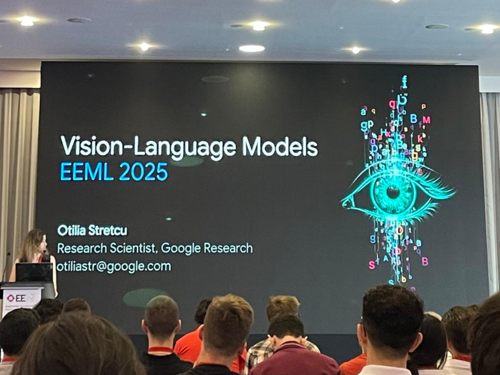
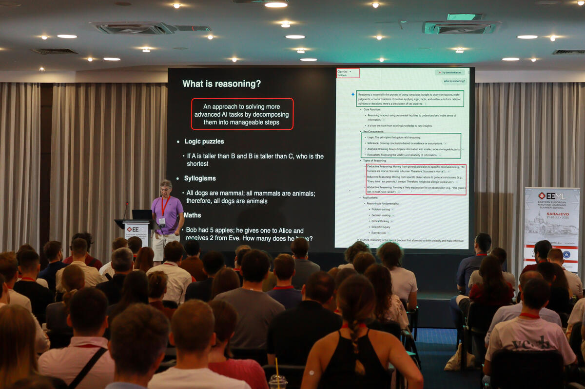
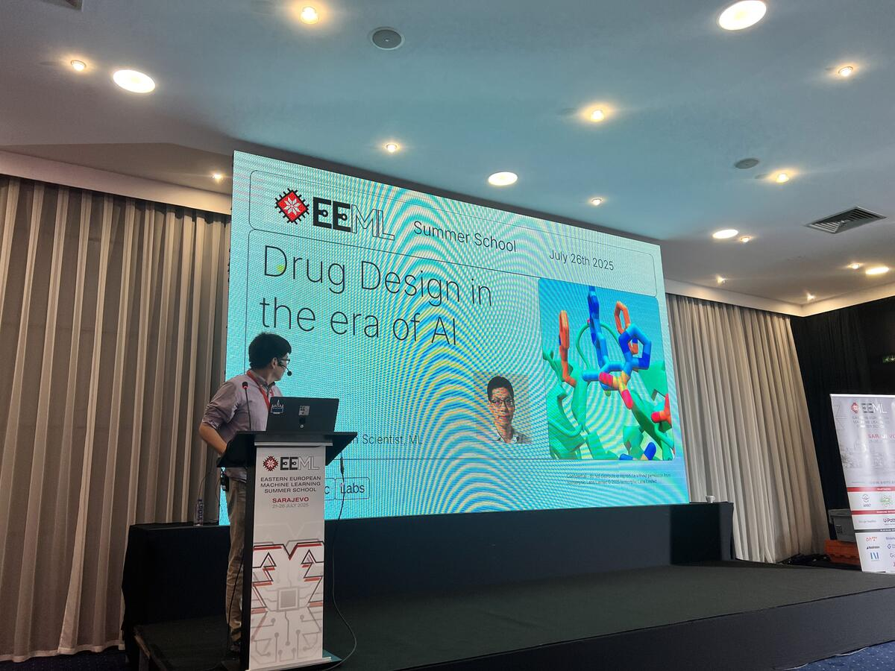
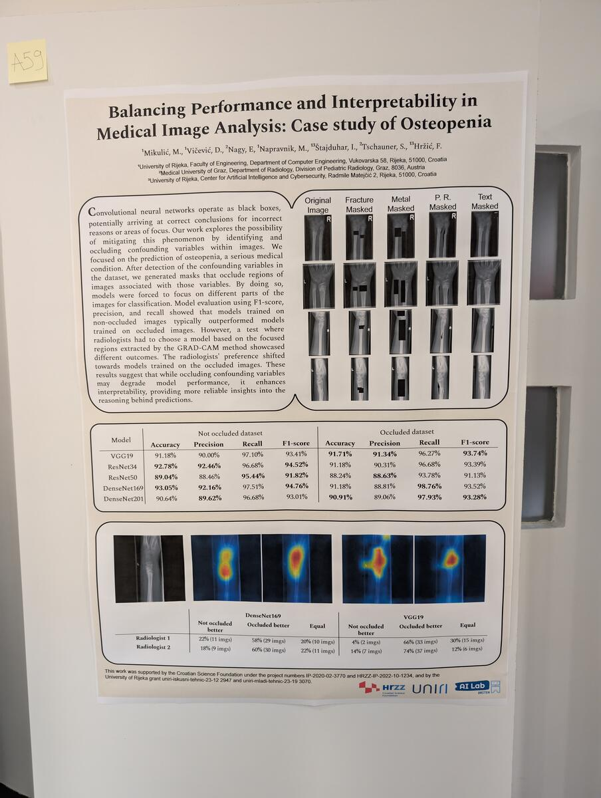
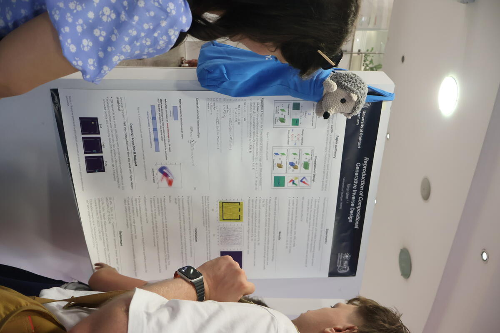
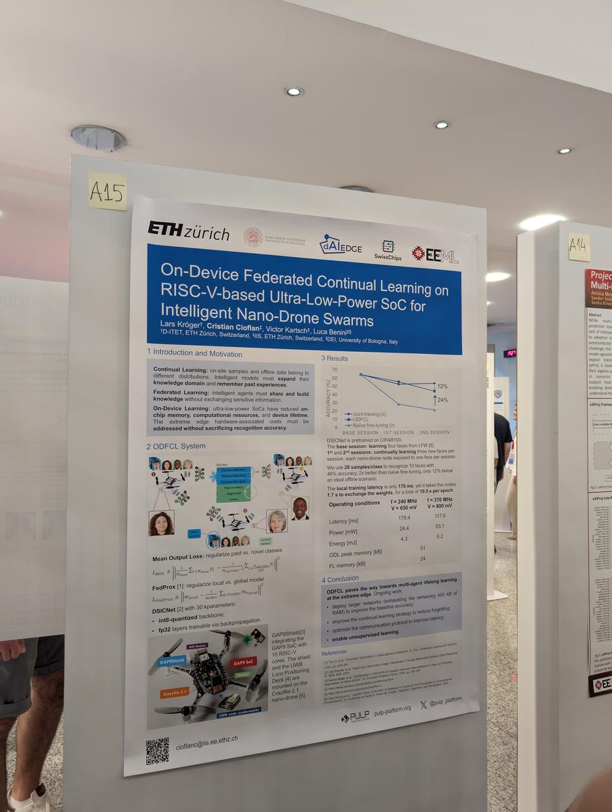
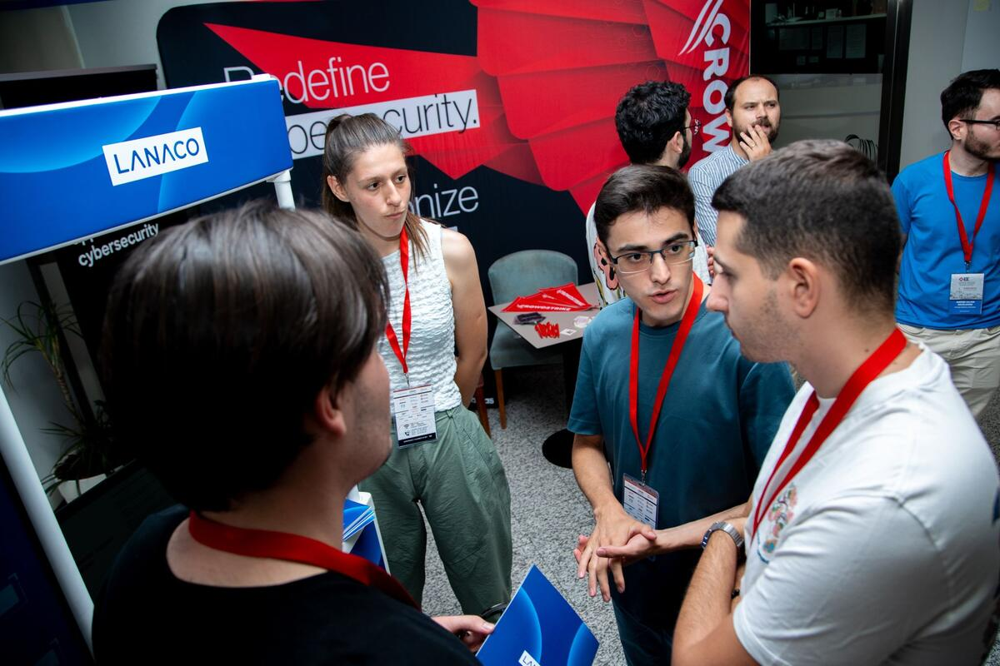
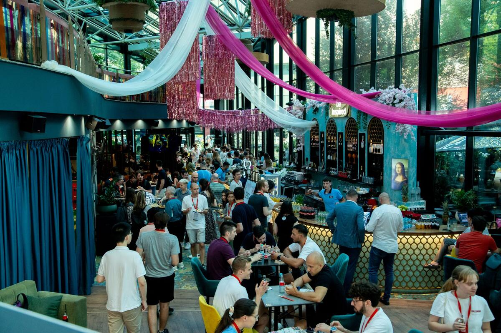
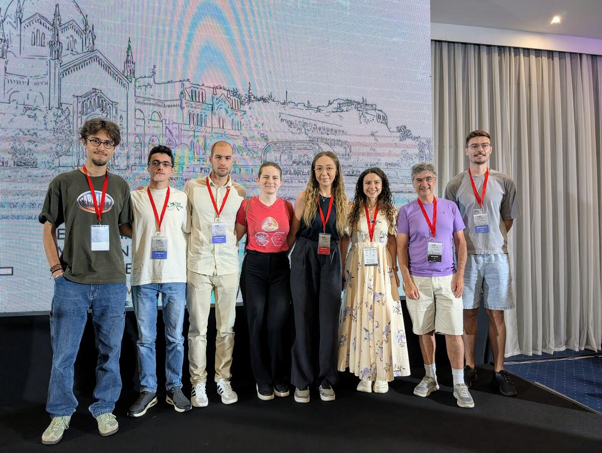

## What is EEML?

[EEML](https://www.eeml.eu/) is a one-week summer school covering core topics in machine learning and artificial intelligence. The programme includes both lectures and hands-on workshops designed to enhance both theoretical understanding and practical skills.

> **EEML 2025 by the Numbers:**
> - Around 1000 applications (most popular edition ever!)
> - ~20% acceptance rate
> - 300 participants from 44+ countries (including industry)

## A Long-Awaited Opportunity

This wasn't my first encounter with EEML. Last year, I was determined to attend and even began working on a research paper with a colleague. Unfortunately, university commitments forced us to withdraw at the last moment.

When EEML 2025 was announced for **Sarajevo**, I knew this was my chance. What many people don't realise is that this programme rivals the quality of top-tier conferences around the world. Having such world-class content and speakers in my homeland made it an opportunity I simply couldn't miss.

## Standout Lectures

The programme featured a series of talks, ranging from deep learning and reinforcement learning theory (including introductions to multi-agent and real-time RL), to applied topics such as computer vision,natural language processing, and medical applications. You can get a concise overview [here](https://www.eeml.eu/program). 

Several lectures particularly caught my attention:

**Computer Vision - João Carreira**  
An excellent overview of computer vision's trajectory - from CNNs through Vision Transformers to Perceiver Transformer-based models. The Perceiver architecture was particularly interesting: using cross-attention and latent self-attention where data only enters through the cross-attention mechanism, allowing smaller latent array sizes whilst accepting any modality (images, video, audio, point clouds) and overcoming computational bottlenecks in Transformers.

The language + vision integration was well-covered, though it left me wondering whether we're sometimes overcomplicating things by forcing language into every vision task.

**Vision-Language Models - Otilia Stretcu**  
A thorough exploration of how vision and language processing are converging, with practical insights into multimodal AI systems. The lecture highlighted current trends: integrating language into vision, adopting transformers, and scaling up training data and model size.

This reinforced my earlier thoughts - perhaps we need to put the vision back in vision and learning. Efficiency tricks for edge devices might be more valuable than bigger models, especially given economic pressures around speed, size, power, and reliability. That's my take, anyway.

**Reasoning with LLMs - Samy Bengio**  
A comprehensive review of recent papers exploring reasoning in large language models. Samy outlined the current state of the field, highlighting both promising developments and fundamental limitations.

His emphasis on the scientific nature of this research - that we need rigorous investigation rather than assumptions - really resonated with me. It made me think about the importance of clearly distinguishing between science (understanding what works and why) and engineering (building practical solutions), and investing accordingly based on actual needs rather than hype.

**Protein Folding - Alden Hung**  
A captivating presentation exploring the AlphaFold revolution - from AlphaFold 2's breakthrough in protein structure prediction to AlphaFold 3's expanded capabilities. This demonstrated how AI is fundamentally changing our understanding of protein structures and complemented the previous day's drug discovery session, showing how machine learning is transforming pharmaceutical research.

The potential for these advances to accelerate drug discovery and disease prediction is genuinely exciting. However, clinical deployment still demands caution - such critical applications require explainable models where we understand not just what AI systems predict, but why they make those predictions. Prediction alone, without understanding the underlying mechanisms, isn't sufficient when human health is at stake. This is where explainable AI becomes crucial.

## The poster sessions
The poster sessions on Tuesday and Wednesday evenings provided an excellent platform for all participants to present their research to peers and speakers alike. These 3-hour sessions often extended well beyond their scheduled time, with participants engaging in extended discussions about research directions and networking opportunities. Some pictures from the poster sessions are below:

  
    
  
  
  

Some standout posters that caught my attention included:
- [Balancing Performance and Interpretability in Medical Image Analysis: Case study of Osteopenia](https://pubmed.ncbi.nlm.nih.gov/39020155/)
- [RT-GS2: Real-Time Generalizable Semantic Segmentation for 3D Gaussian Representations](https://arxiv.org/abs/2405.18033)
- Graph positional and structural encodings for creating tissue-aware embeddings for cells 
- [On-device federated continual learning on RISC-V-based Ultra-Low-Power SoC for Intelligent Nano-Drone Swarms](https://www.arxiv.org/abs/2503.17436)

## Networking and Connections

The networking opportunities were incredible, and honestly, as someone who's naturally more reserved, I surprised myself with how many people I managed to connect with!

**Technical Discussions and Career Insights** 

I had more conversations than I expected, covering an impressive range of topics and projects. The diversity of work was remarkable - from high-performance Python implementations achieving 10-100x speedups by compiling to native machine code, to autonomous robotics projects combining multiple computer vision architectures for real-world applications. One particularly interesting area was deepfake detection and AI-generated content identification - increasingly crucial as synthetic media technology advances. I also had the chance to chat with several people about NLP projects in document management, discussing which open-source models had proven effective and sharing different approaches for benchmarking on custom datasets. It's always valuable hearing how others approach similar technical challenges.

Learning about others' experiences studying abroad and their research was incredibly valuable for my own future planning. Discussions about international master's programmes (which I've been exploring) provided practical insights I couldn't find elsewhere.

**BHFF Community Connection**  

One of the highlights was connecting with fellow BH Futures Foundation alumni and scholars who were also attending EEML. It's always nice to see how our BHFF community continues to grow and excel in various fields!

**What a moment!** Meeting Samy Bengio alongside my BHFF colleagues was truly inspiring.

**Why Such Events Matter**  
These experiences reminded me why events like EEML are so effective: **they inspire and connect people**.

## Final Thoughts

I truly believe that I will always remember **EEML 2025** as a defining moment in my career. I’m deeply grateful to my mentors at LANACO and BHFF – their ongoing guidance and support over the years made this opportunity possible. Meeting so many enthusiastic researchers and professionals was truly inspiring.

Huge thanks to the organisers and volunteers for all their hard work in making this amazing event happen. I hope I'll have the chance to contribute to this community myself one day ❤️.

---

**📺 Note:** All EEML 2025 lectures are available on the [official EEML Community YouTube channel](https://www.youtube.com/@eemlcommunity3531). I highly recommend checking them out if you're interested in any of these topics!

---
