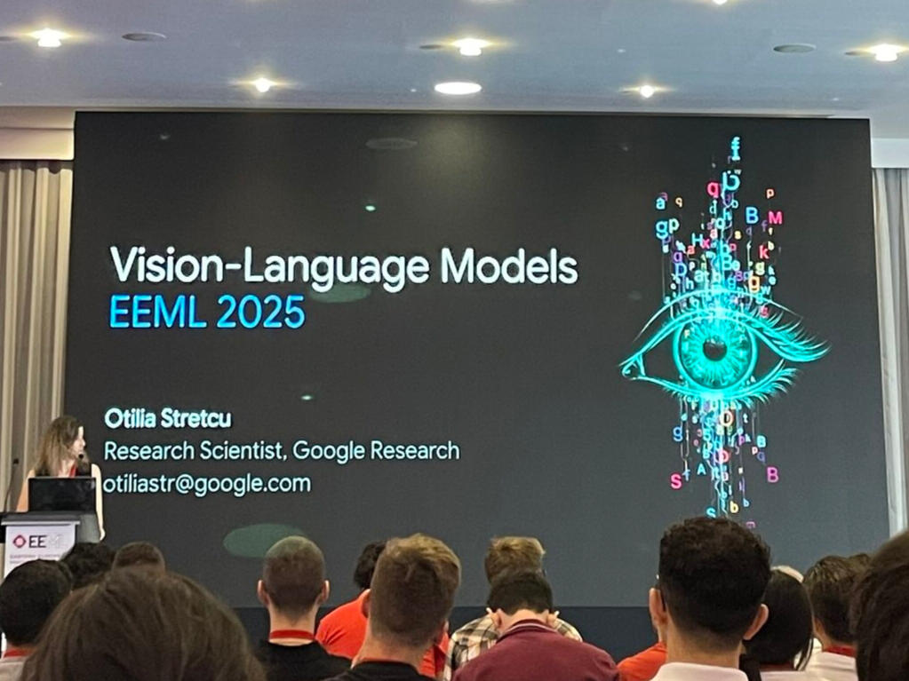
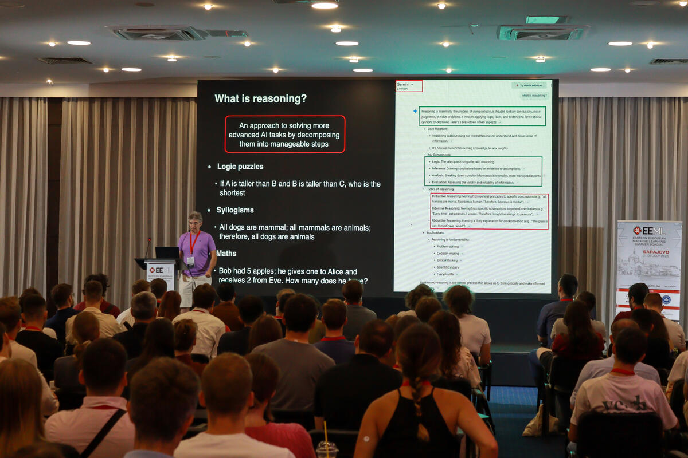
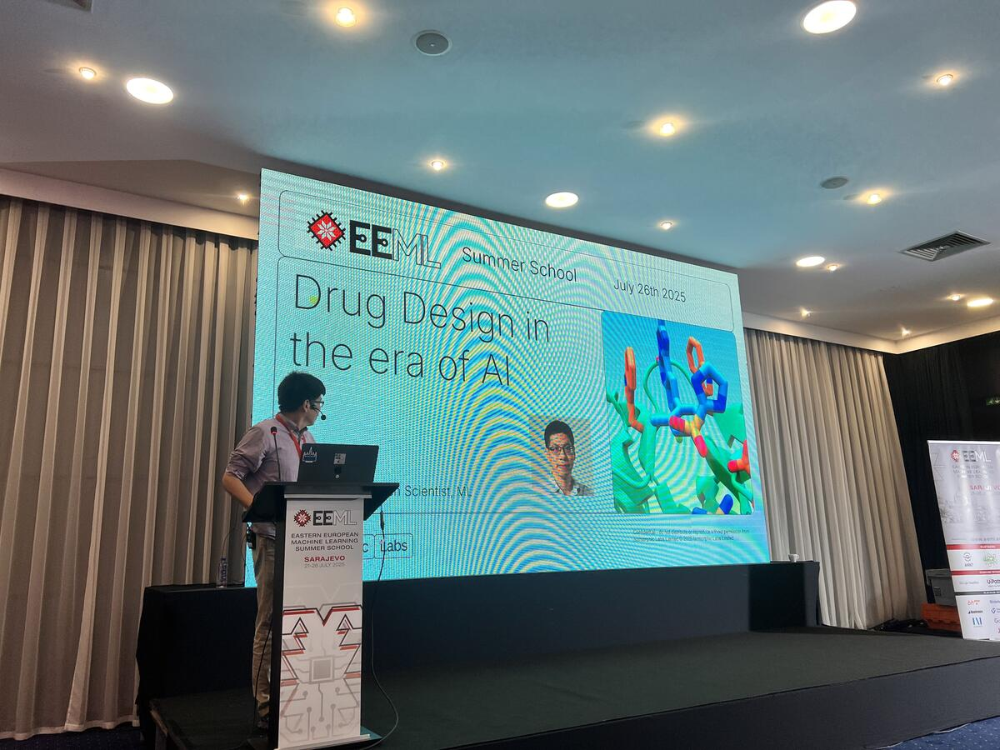
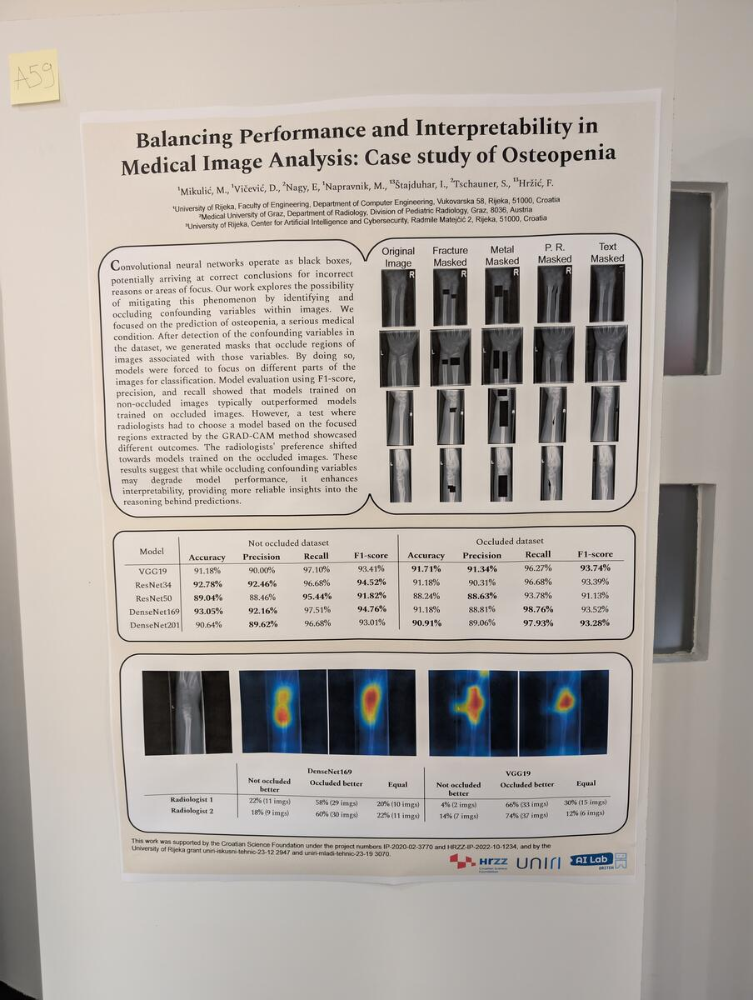
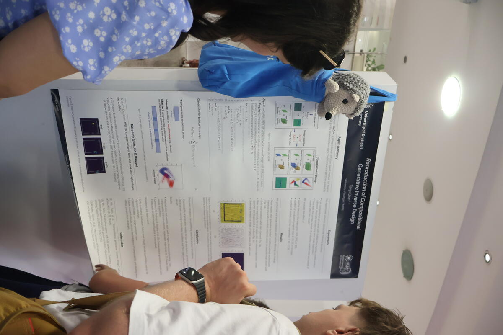
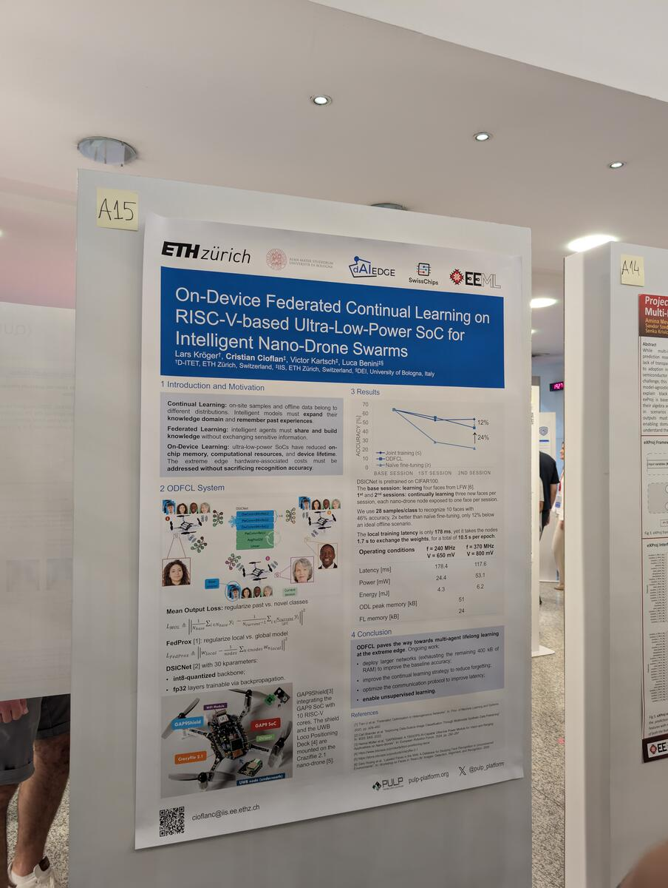
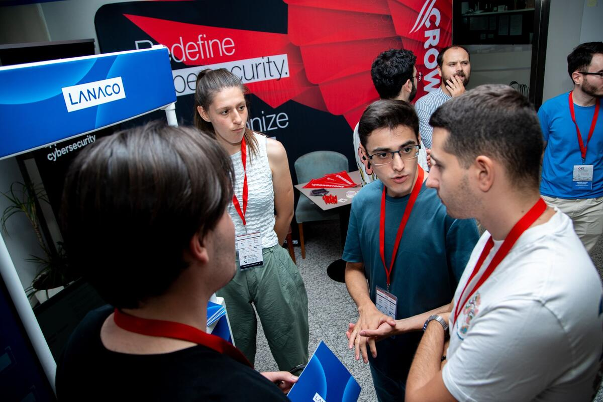
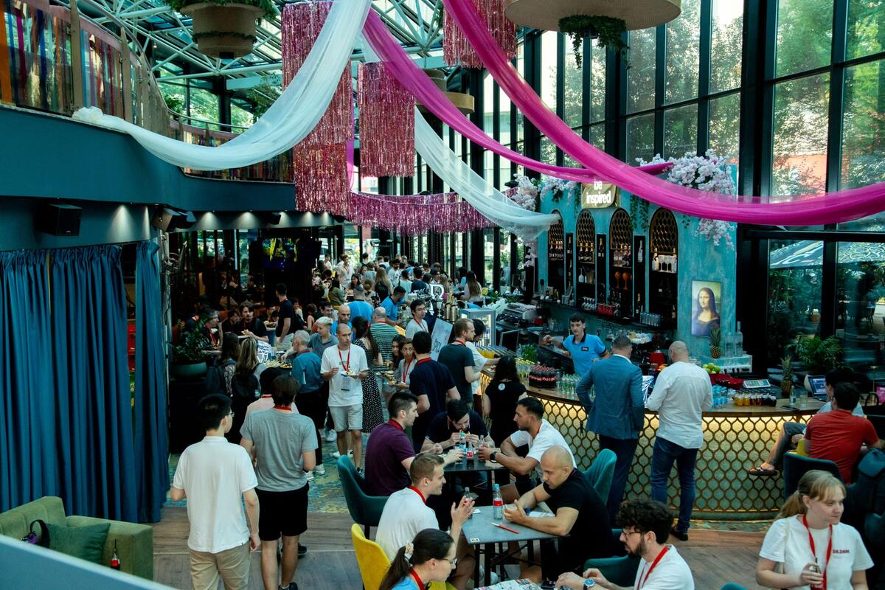
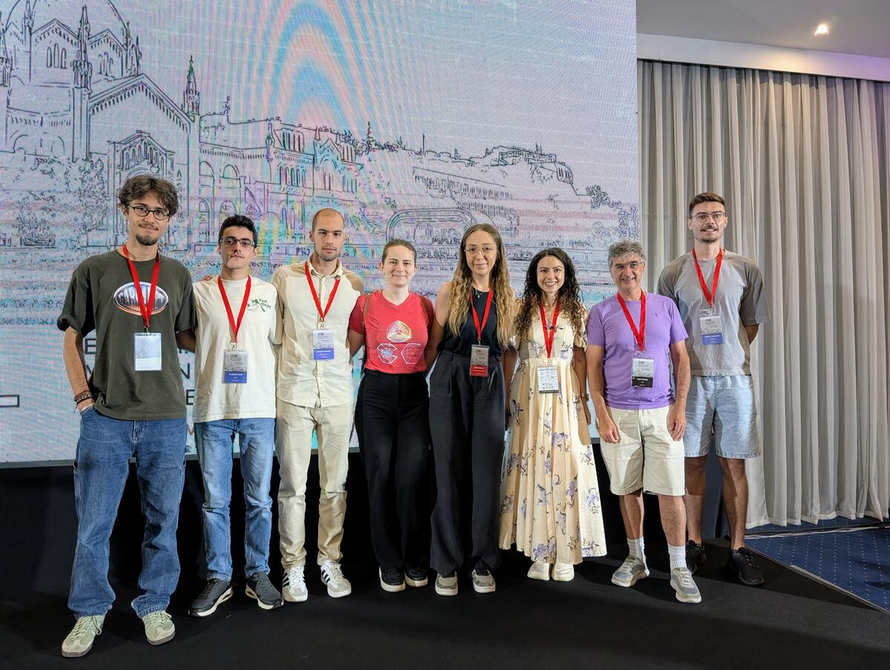

## What is EEML?

[EEML](https://www.eeml.eu/) is a one-week summer school covering machine learning and AI. The programme combines lectures with hands-on workshops covering both theory and practice.

> **EEML 2025 by the Numbers:**
> - Around 1000 applications (most popular edition ever!)
> - ~20% acceptance rate
> - 300 participants from 44+ countries (including industry)

## A Long-Awaited Opportunity

This wasn't my first attempt at EEML. Last year, I was planning to attend and had started working on a research paper with a colleague, but university commitments forced us to withdraw at the last moment.

When EEML 2025 was announced for **Sarajevo**, I knew I had to go. The programme matches the quality of top international conferences, and having that level of content delivered in my home country made it an easy decision.

## Standout Lectures

The programme covered deep learning and reinforcement learning theory (including multi-agent and real-time RL), alongside applied topics such as computer vision, natural language processing, and medical applications. A full overview is available on [the EEML programme page](https://www.eeml.eu/previous-editions/eeml2025/program).

Several lectures stood out:

**Computer Vision - João Carreira**  
A clear survey of computer vision's development: from CNNs through Vision Transformers to Perceiver Transformer-based models. The Perceiver architecture was particularly interesting. It uses cross-attention and latent self-attention, with data entering only through the cross-attention mechanism. This allows smaller latent array sizes whilst accepting any input modality (images, video, audio, point clouds), sidestepping the computational bottlenecks of standard Transformers.

The language and vision integration was covered in detail, though it raised a question for me: are we sometimes overcomplicating things by coupling language with every vision task?

**Vision-Language Models - Otilia Stretcu**  
This lecture covered how vision and language processing are converging, with concrete examples of multimodal AI systems. The key trends highlighted were integrating language into vision, adopting transformers, and scaling training data and model size.

This reinforced my earlier question. Perhaps we need to put the vision back into vision and learning. Efficient models for edge deployment may be more valuable than ever-larger ones, given the practical constraints around speed, size, power consumption, and reliability.

**Reasoning with LLMs - Samy Bengio**  
A survey of recent papers on reasoning in large language models, covering both promising developments and current limitations.

His emphasis on scientific rigour, that we need careful investigation rather than assumptions, stuck with me. It reinforced the importance of distinguishing between science (understanding what works and why) and engineering (building practical solutions), and prioritising investment based on actual needs rather than hype.

**Protein Folding - Alden Hung**  
This talk covered AlphaFold's development from AlphaFold 2's breakthrough in protein structure prediction through to AlphaFold 3's expanded capabilities, and how this work connects to drug discovery and pharmaceutical research more broadly.

The potential to accelerate drug discovery and disease prediction is real, but clinical deployment requires care. These applications need explainable models: we need to understand not just what a system predicts, but why it makes that prediction. Prediction without mechanistic understanding is not sufficient when human health is at stake.

## The Poster Sessions

The poster sessions on Tuesday and Wednesday evenings gave all participants a chance to present their research to peers and speakers. These three-hour sessions regularly ran over time, with discussions stretching well into the evening. Some pictures from the poster sessions are below:

  
    
  
  
  

Posters that stood out for me:
- [Balancing Performance and Interpretability in Medical Image Analysis: Case study of Osteopenia](https://pubmed.ncbi.nlm.nih.gov/39020155/)
- [RT-GS2: Real-Time Generalizable Semantic Segmentation for 3D Gaussian Representations](https://arxiv.org/abs/2405.18033)
- Graph positional and structural encodings for creating tissue-aware embeddings for cells 
- [On-device federated continual learning on RISC-V-based Ultra-Low-Power SoC for Intelligent Nano-Drone Swarms](https://www.arxiv.org/abs/2503.17436)

## Networking and Connections

Honestly, as someone who tends to be more reserved, I surprised myself with how many people I ended up talking to.

**Technical Discussions and Career Insights** 

I had more conversations than expected, covering a wide range of topics. The work varied considerably: from high-performance Python implementations achieving 10-100x speedups through compilation to native machine code, to autonomous robotics projects combining multiple computer vision architectures for real-world applications. Deepfake detection and AI-generated content identification came up too, which is becoming increasingly important as synthetic media technology improves. I also spoke with several people about NLP projects in document management, comparing open-source models and approaches for benchmarking on custom datasets.

Hearing about others' experiences studying abroad was useful for my own planning around graduate programmes, which I've been looking into.

**BHFF Community Connection**  

It was good to see fellow BH Futures Foundation alumni and scholars at EEML too.

Meeting Samy Bengio alongside BHFF colleagues was a highlight of the week.

**Why Such Events Matter**  
Events like EEML work because they bring people together who wouldn't otherwise meet. The conversations outside the lecture hall were often as valuable as the sessions themselves.

## Final Thoughts

**EEML 2025** will stay with me for a long time. I'm grateful to my mentors at LANACO and BHFF, whose support over the years made this possible. Meeting researchers and practitioners working on interesting problems across so many fields was motivating.

Thanks to the organisers and volunteers who made it all happen. I hope to contribute to this community myself one day ❤️.

---

**📺 Note:** All EEML 2025 lectures are available on the [EEML Community YouTube channel](https://www.youtube.com/@eemlcommunity3531). Worth checking out if any of these topics interest you.

---
